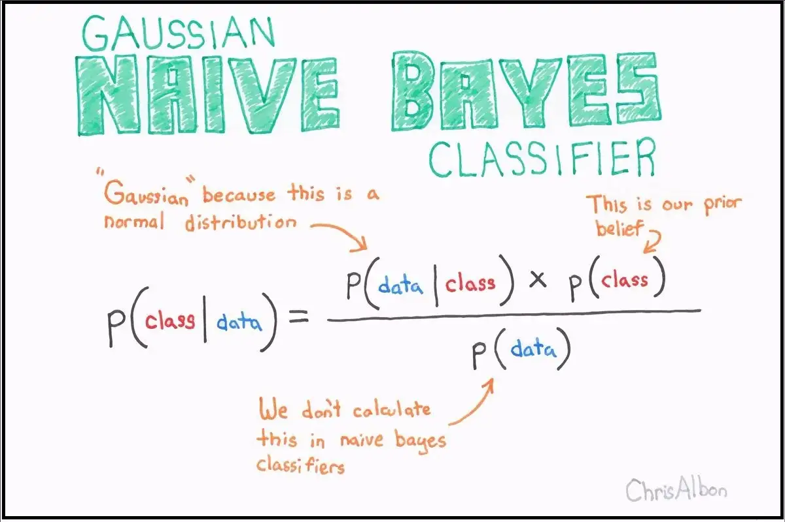

# Catatan 

 

 sumber : https://www.analisis-data.com/2018/11/algoritma-naive-bayes-classifier.html 

 

 
Algoritma Naïve Bayes adalah teknik klasifikasi berdasarkan penerapan teorema Bayes dengan asumsi kuat bahwa semua prediktor independen satu sama lain.

 
Keterangan:
P (c | x) adalah probabilitas posterior kelas (c, target) yang diberikan prediktor (x, atribut).
P ( c ) adalah probabilitas kelas sebelumnya.
P (x | c) adalah kemungkinan yang merupakan probabilitas kelas yang diberikan prediktor.
P (x) adalah probabilitas prediktor sebelumnya.

Ada tiga jenis model Naïve Bayes :

<h2>Gaussian Naïve Bayes</h2>
Ini adalah penggolong Naïve Bayes yang paling sederhana yang memiliki asumsi bahwa data dari masing-masing label diambil dari distribusi Gaussian yang sederhana.

<h2>Multinomial Naïve Bayes</h2>
Klasifikasi Naïve Bayes lain yang bermanfaat adalah Multinomial Naïve Bayes di mana fitur diasumsikan diambil dari distribusi Multinomial sederhana. Jenis Naïve Bayes seperti itu paling tepat untuk fitur yang mewakili jumlah diskrit.

<h2>Bernoulli Naïve Bayes</h2>
Model penting lainnya adalah Bernoulli Naïve Bayes di mana fitur diasumsikan biner (0s dan 1s). Klasifikasi teks dengan model ‘bag of words ‘dapat menjadi aplikasi Bernoulli Naïve Bayes.

# Project

<h2> Breast Cancer</h2>
 
https://rpubs.com/yohanesegi2608/naivebayes_breastcancer
